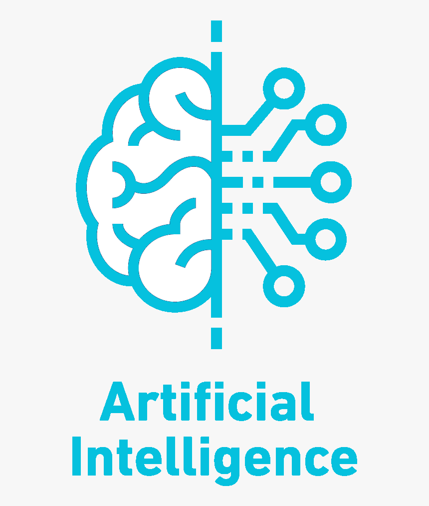

 

     
     
    Computer Science student

### A motivated computer science student who loves learning and challengling himself on a daily basis 

<!-- 

 -->

 

<!-- ### My Goals by the end of 2022
#### ▶: working on, ✅: done, ⭕: not started yet
<ul>
 <li>
  Holding a successful Flutter workshop at SBU ⭕
  </li>
 <li>
  Creating content for my youtube channel to reach 100 subscribers by the end of 2022 ⭕
 </li>
 <li>
  Daily Hackerrank challenge:
  1 python, 1 SQL, 1 database, 1 C++, 1 shell 
  question every day. early in the morning ▶
 </li>
 <li>
    Reaching 5 research interest score in hackerrank ▶ 
 </li>
 <li>
    Reaching total average GPA of 18 ▶
 </li>
 <li>
    Becomming a successful TA in the basic programming course ▶
 </li>
 <li>
    starting a serious research paper on programming languages with an advisor ⭕
 </li>
 <li>
 1000 wakatime hours ▶
 </li>
</ul>
 -->

### My Scientific Interests

<table>
<tr>
<td align="center">

    Data Science

</td>
<td align="center">

    Machine Learning

</td>
<td align="center">

    Artificial Intelligence

</td>
<td align="center">

    Statistics

</td>
</tr>
<table>

### My SE Interests
<table>
<tr>
<td align="center">

    Python

</td>
<td align="center">

    git

</td>
<td align="center">

    Dart

</td>
<td align="center">

    Flutter

</td>
</tr>
<table>

### Contact me 

 

 

### My Stats

 

                                                                                        
   

### Contact me ☎
 

 
 
                                                                                                     

<!-- 

 -->
 
                                            
