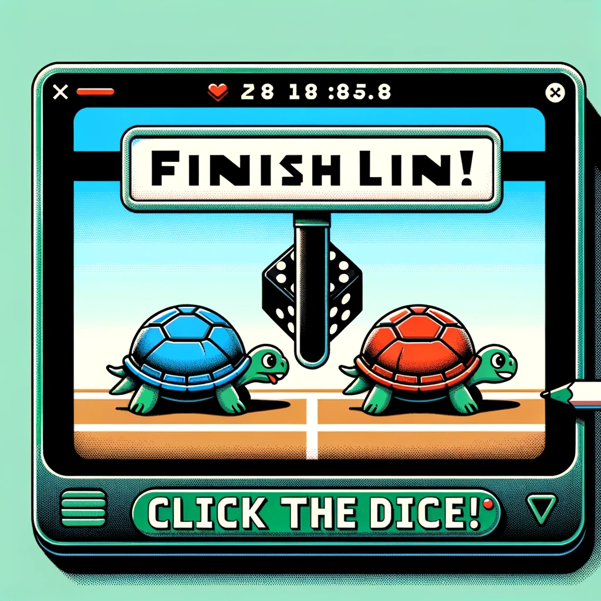
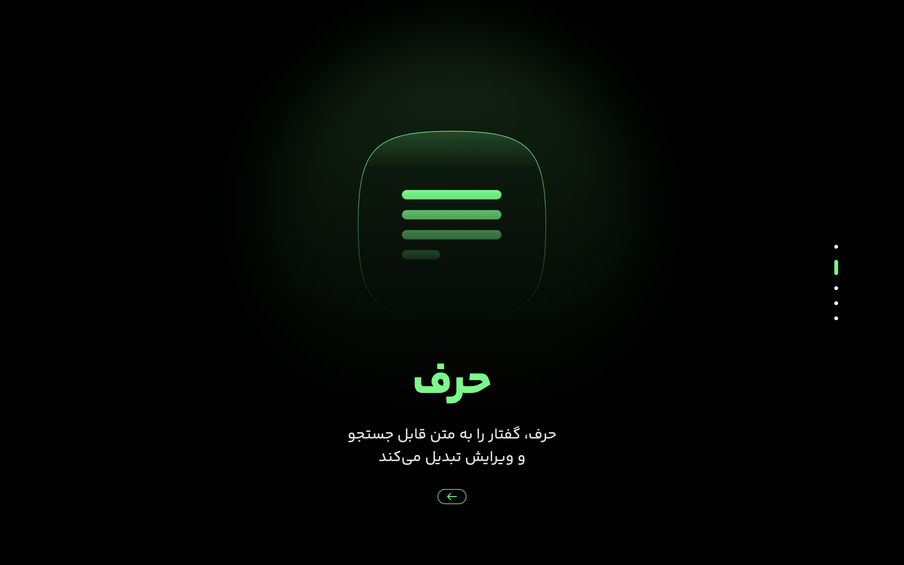
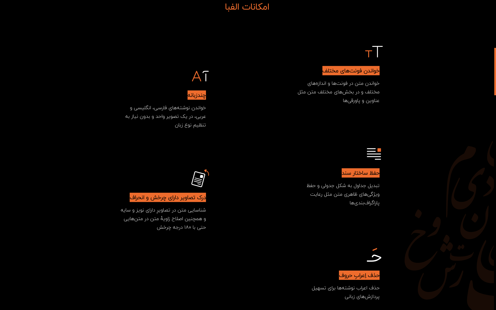
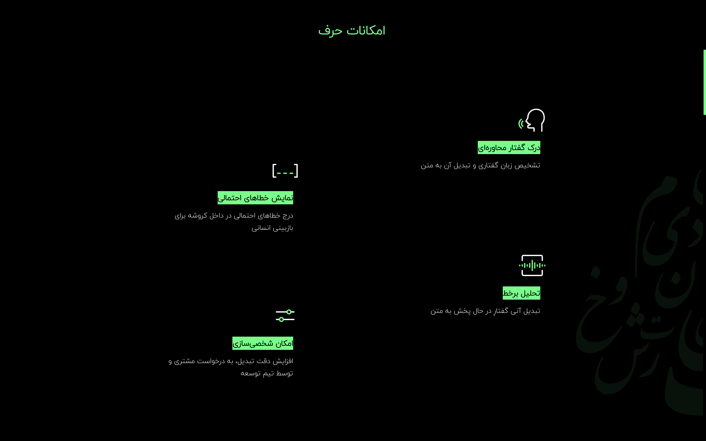
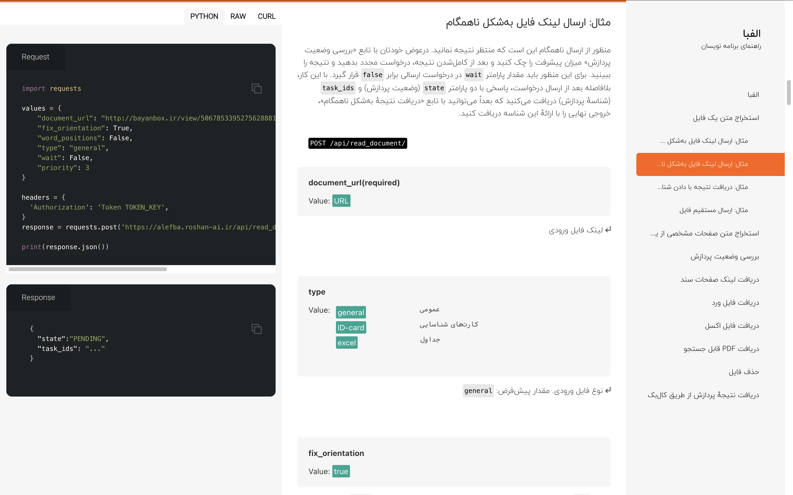

# 🗂️ **My Portfolio**

*Showcasing a fusion of creativity, innovation, and user-centered design.*  

From *refined UI/UX designs* and *intuitive software solutions* to *insightful user research*, this portfolio reflects my drive to create impactful experiences. With a focus on **precision**, **cutting-edge tools**, and **human-centered thinking**, I’m dedicated to pushing the boundaries of **User Experience Design**.

  
<strong>💻 Programming</strong>

   

  
<strong>1️⃣ Jalgorithm</strong>

  

  **Description:**  
  Jalgorithm is a Java-based, open-source library that provides implementations of various algorithms and data structures. Designed for students, developers, and educators, it is both an educational resource and a practical tool for algorithmic problem-solving. The project has been published as a Java library, making it accessible for direct integration into Java applications. Its open-source nature has encouraged contributions, adding to its utility and robustness.

  **Technologies Used:**  
  - **Java:** For implementing data structures, algorithms, and creating the published library.  

  **Key Features:**  
  - **Comprehensive Algorithm Implementations:** Includes sorting, searching, and graph algorithms.  
  - **Data Structure Examples:** Implements data structures like stacks, queues, and trees.  
  - **Educational Focus:** Clean, well-documented code and examples tailored for learning and understanding.  
  - **Open Source with Contributions:** Actively maintained with community contributions.  
  - **Published Library:** Available as a Java library for seamless integration into projects.  

  **Links:**  
  - [**View on GitHub**](https://github.com/mohammadkarbalaee/jalgorithm)  
  - [**Live Demo**](https://youtu.be/0YPAG9GCBn8?si=6RAGI3SYNWHZKUxo)  

  
<strong>2️⃣ Python Turtle Game</strong>

  

  **Description:**  
  This repository contains fun and interactive games built using Python's `turtle` module. It showcases the creative use of turtle graphics to develop engaging, visually appealing, and educational projects. The collection includes games that are easy to understand and play, making it a perfect resource for beginners looking to learn Python programming through hands-on examples.

  **Technologies Used:**  
  - **Python:** For creating interactive games using the `turtle` library.  

  **Key Features:**  
  - **Interactive Games:** Engaging projects like dice-based games and more, created with the `turtle` library.  
  - **Beginner-Friendly Code:** Simplified logic and clear comments to aid learning and understanding.  
  - **Educational Focus:** Designed to teach Python programming concepts interactively.  
  - **Graphical Outputs:** Utilizes Python's turtle graphics for vibrant and visually appealing game designs.  

  **Links:**  
  - [**View on GitHub**](https://github.com/mohammadkarbalaee/python-turtle)  

  
<strong>3️⃣ Roshan AI Landing Pages</strong>

   
  
  
  

  **Description:**  
  This project involves designing and developing engaging landing pages for Roshan AI's products. The landing pages are crafted to highlight the innovative features of the products, ensuring a visually appealing and user-friendly experience. These pages focus on showcasing Roshan AI's cutting-edge solutions effectively while maintaining brand consistency.

  **Technologies Used:**  
  - **React.js:** For creating dynamic and interactive user interfaces.  
  - **HTML, CSS, JavaScript:** For building the structure, styling, and interactivity of the pages.

  **Key Features:**  
  - **Responsive Design:** Optimized for all devices, ensuring seamless user experience across desktops, tablets, and smartphones.  
  - **Engaging Layouts:** Clean and modern UI/UX design to attract and retain users' attention.  
  - **Focus on Conversion:** Strategically designed to enhance user interaction and product inquiries.  
  - **SEO Optimized:** Implemented best practices to improve visibility and search rankings.

  **Links:**  
  - [**Roshan AI**](https://www.roshan-ai.ir/)  
  - [**Alefba Product Page**](https://www.roshan-ai.ir/alefba/)  
  - [**Harf Product Page**](https://www.roshan-ai.ir/harf/)  
  - [**GitHub Repository**](https://github.com/roshan-research/roshan-research.github.io)  

  **Demo Videos:**  
  - [**Demo 1: Overview of Roshan AI**](https://drive.google.com/file/d/1pcAv90jp3iuqhNJhAV2LgCVHFauo3vna/view?usp=sharing)  
  - [**Demo 2: Alefba Product Features**](https://drive.google.com/file/d/1c45d7mWXTsvfe_U8KlxOPQEmaekgHlAe/view?usp=sharing)  
  - [**Demo 3: Harf Product Features**](https://drive.google.com/file/d/1kxM846cSILGQ2Hi5Vkq-qLceEHBYqypJ/view?usp=sharing)  
  - [**Demo 4: Audio Player**](https://drive.google.com/file/d/1ApYqqwPox26nyVO08uBvBDxYG8NXaTnm/view?usp=sharing)  

  
<strong>4️⃣ API Documentation Website</strong>

   

  **Description:**  
  This project involves creating a comprehensive API documentation website for the Alefba product, a part of Roshan AI. The website is designed to provide developers with clear, detailed, and easy-to-navigate documentation, enabling seamless integration with Alefba's APIs. It focuses on usability, ensuring that developers can quickly find the information they need.

  **Technologies Used:**  
  - **React.js:** For building a dynamic and responsive user interface.  
  - **Markdown and HTML:** For structuring and presenting the documentation content.  
  - **CSS and JavaScript:** For styling and interactivity.  
  - **API Integration:** Connected with live API endpoints for interactive documentation.

  **Key Features:**  
  - **Interactive Documentation:** Includes live examples and endpoints for real-time API testing.  
  - **Searchable Content:** Quick search functionality to help developers find specific sections or endpoints.  
  - **Developer-Friendly Design:** Clean and minimal UI to maximize focus on the documentation.  
  - **Responsive and Accessible:** Optimized for both desktop and mobile viewing.  
  - **Mobile-Friendly:** Fully functional and user-friendly on smaller screens.  

  **Links:**  
  - [**Github Repository**](https://github.com/roshan-research/docs)
  - [**Alefba API Documentation**](https://www.roshan-ai.ir/docs/alefba)  

  **Demo Video:**  
  - [**Desktop Demo**](https://drive.google.com/file/d/1oFs2yBYRiGSs6AMe6PDOsrzT9r80XxTR/view?usp=sharing)
  - [**Mobile Demo**](https://drive.google.com/file/d/1yBu1gYKSHttEANgKGDraRgsey33EaIgt/view?usp=sharing)    

  
<strong>5️⃣ Flutter Modal Date Picker</strong>

   

  **Description:**  
  This project is a Flutter package that provides a customizable modal date picker widget for Flutter applications. The package is designed to offer an intuitive and modern user interface for date selection, enhancing the user experience in apps that require scheduling, calendar functionality, or date inputs. It’s available on Pub.dev and GitHub for developers to integrate seamlessly into their Flutter projects.

  **Technologies Used:**  
  - **Flutter:** For developing a cross-platform package.  
  - **Dart:** The programming language used to build the package.  

  **Key Features:**  
  - **Customizable UI:** Easily adjustable to match the application's theme and style.  
  - **Responsive Design:** Works seamlessly across devices, including mobile and tablets.  
  - **User-Friendly:** Intuitive modal design for easy date selection.  
  - **Open Source:** Actively maintained with community contributions encouraged.  
  - **Pub.dev Integration:** Easy installation and use in any Flutter project.  

  **Links:**  
  - [**GitHub Repository**](https://github.com/mohammadkarbalaee/flutter_modal_date_picker)  
  - [**Pub.dev Package**](https://pub.dev/packages/flutter_modal_date_picker)  

  
<strong>🎨 Design</strong>

