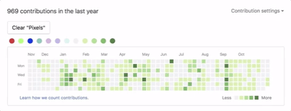
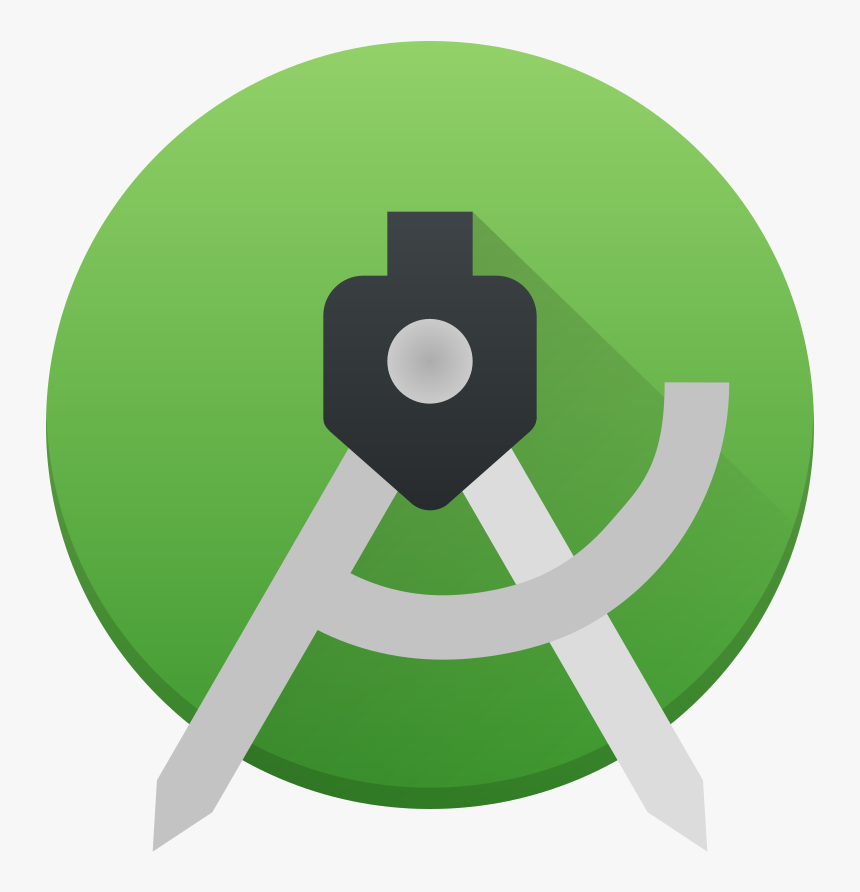
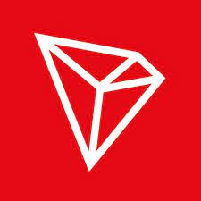
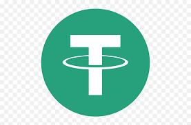

<p align="center" style="z-index:150">


<a href="https://wakatime.com/@muhammadksht">

</a>
</p>
<br>

<!-- Todos
- Watch the making game engine with java course
- create full tutorial on how to write telegram bots with java
- read spring in action book
- watch deep learning with pytorch course -->


<p align="center">
    
</p>

<p align="center">
    
</p>

<table align="center">
<tr>
<td align="center">

</td>
<td align="center">

</td>
<td align="center">

</td>
    <td>
        
    </td>    
</tr>
<table>
    
<p align="center" style="white-space:nowrap;">
       
    
    
</p>
    
<table align="center">
<tr>
<td align="center">

</td>
<td align="center">

</td>
    <td>
        
    </td> 
    <td>
        
    </td> 
<td align="center">

</td>
    <td align="center">
    <p align="center">
        &nbsp;&nbsp;&nbsp;&nbsp;&nbsp;&nbsp;&nbsp;&nbsp;&nbsp;&nbsp;&nbsp;&nbsp;&nbsp;&nbsp;&nbsp;&nbsp;&nbsp;&nbsp;&nbsp;&nbsp;&nbsp;&nbsp;&nbsp;&nbsp;&nbsp;&nbsp;&nbsp;&nbsp;&nbsp;&nbsp;&nbsp;&nbsp;&nbsp;&nbsp;&nbsp;&nbsp;&nbsp;&nbsp;&nbsp;&nbsp;&nbsp;&nbsp;&nbsp;&nbsp;&nbsp;&nbsp;&nbsp;&nbsp;&nbsp;&nbsp;&nbsp;&nbsp;&nbsp;&nbsp;&nbsp;&nbsp;&nbsp;&nbsp;&nbsp;&nbsp;&nbsp;&nbsp;&nbsp;&nbsp;&nbsp;&nbsp;&nbsp;&nbsp;&nbsp;&nbsp;&nbsp;&nbsp;&nbsp;&nbsp;&nbsp;&nbsp;&nbsp;&nbsp;&nbsp;&nbsp;&nbsp;&nbsp;&nbsp;&nbsp;&nbsp;&nbsp;&nbsp;&nbsp;&nbsp;&nbsp;&nbsp;&nbsp;&nbsp;&nbsp;&nbsp;&nbsp;&nbsp;
    </p>
    </td>
    <td align="center">
        
    </td>
    <td align="center">
        
    </td>
</tr>
<table>

<p align="center">


</p>

<br>


<table align="center">
<td>
<a href="https://gitlab.com/muhammad-karbalaee">
    
</a>
<a href="https://www.youtube.com/channel/UCI1BKsmNKbCVfxsxjL7SSRQ">
    
</a>
<a href="https://www.linkedin.com/in/muhammad-karbalae/">
    
</a>
<a href="https://twitter.com/Muhammad_ksht">
     
</a>
<a href="https://www.instagram.com/muhammad_karbalaee">
     
</a>
<a href="https://www.facebook.com/muhammad.karbalaeeshabani">
     
</a>
<a href="http://t.me/muhammad_karbalaee">
    
</a>
<a href="mailto:muhammad.ksht@gmail.com">
    
</a>
<a href="https://wa.me/989373899988">
   
</a>
<a href="https://stackoverflow.com/users/14618677/muhammad-karbalaee-shabani">
    
</a>
<a href="https://www.hackerrank.com/muhammad_ksht">
    
</a>
</td>
</table>

</br>
 
    
### Donation ☕
Your donations help me build new projects and create useful content for you. ☺️

<a href="https://coffeebede.ir/buycoffee/muhammadksht">
    Rials👇
    <br>
    </a>
    <br>
<br>
    <a href="https://link.trustwallet.com/send?coin=0&address=bc1qnm05lpkjz0pal33k5ql7vctayqu2vvfqf4cytt">
      
    </a>

```
bc1qnm05lpkjz0pal33k5ql7vctayqu2vvfqf4cytt
```

<a href="https://link.trustwallet.com/send?coin=60&address=0xb3e3bfa9a6eFb8031eCe720D25c50cB5cc6668da">
  
</a>

```
0xb3e3bfa9a6eFb8031eCe720D25c50cB5cc6668da
```

<a href="https://link.trustwallet.com/send?coin=3&address=DAHeY48RtPfvwJrGdspAboBXwRteiEMBCV">
      
</a>

```
DAHeY48RtPfvwJrGdspAboBXwRteiEMBCV
```


<a href="https://link.trustwallet.com/send?coin=20000714&address=0xb3e3bfa9a6eFb8031eCe720D25c50cB5cc6668da&token_id=0x2859e4544C4bB03966803b044A93563Bd2D0DD4D">
      
</a>

```
0xb3e3bfa9a6eFb8031eCe720D25c50cB5cc6668da
```

<a href="https://link.trustwallet.com/send?coin=195&address=TGVuMmEpdZELjHZvYiPi5YZoQchUJk7b3A">
      
</a>

```
TGVuMmEpdZELjHZvYiPi5YZoQchUJk7b3A
```


<a href="https://link.trustwallet.com/send?coin=195&address=TGVuMmEpdZELjHZvYiPi5YZoQchUJk7b3A&token_id=TR7NHqjeKQxGTCi8q8ZY4pL8otSzgjLj6t">
      
</a>

```
TGVuMmEpdZELjHZvYiPi5YZoQchUJk7b3A
```

<a href="mailto:muhammad.ksht@gmail.com">
     contact us for any other payment method you desire
     <br>
     
</a>
<br>
